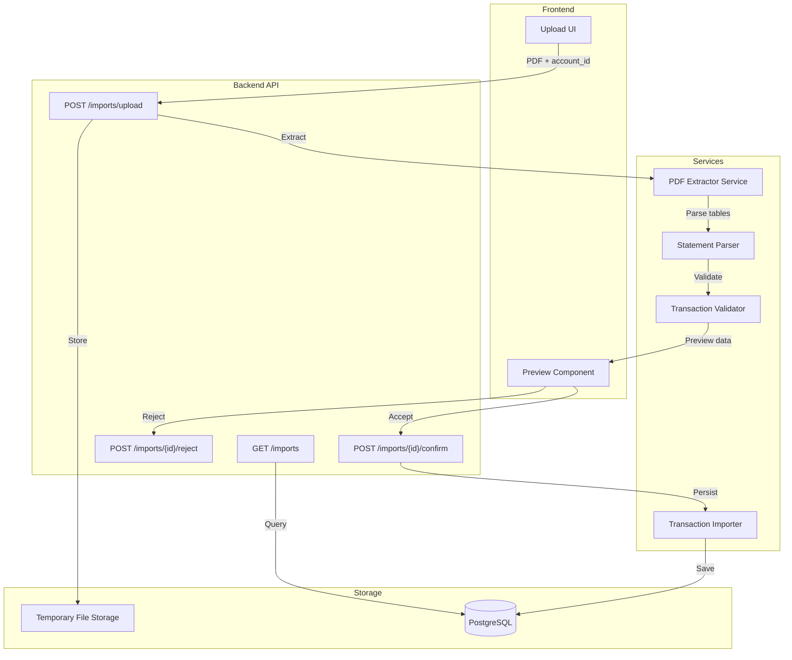

# Design Document: Mastercard PDF Import

## Overview

This feature enables users to import transactions from Desjardins Mastercard PDF statements into the existing personal finance tracker. The system uses pdfplumber to extract transaction data from PDF files, validates and transforms the data, and provides a preview workflow before persisting transactions.

The design follows the existing FastAPI patterns with SQLModel for database models, integrating with the current transaction management system.

## Architecture



### Design Decisions

1. **pdfplumber over Claude Vision**: The requirements specify using pdfplumber for PDF extraction. This is a deterministic, cost-effective approach that works well for structured table data in Desjardins statements.

2. **Two-phase import (preview then confirm)**: Users review extracted data before committing, reducing errors and building trust in the automated extraction.

3. **Temporary storage for PDFs**: Files are stored temporarily during the preview phase and cleaned up after import completion or rejection.

4. **Import sessions for tracking**: Each import operation is tracked as a session, enabling history viewing and linking transactions to their source.

## Components and Interfaces

### 1. PDF Extractor Service

Responsible for reading PDF files and extracting raw text/table data using pdfplumber.

```python
# backend/app/services/pdf_extractor.py

from dataclasses import dataclass
from datetime import date
from pathlib import Path
import pdfplumber

@dataclass
class RawTransaction:
    """Raw transaction data extracted from PDF before validation."""
    date_str: str
    description: str
    amount_str: str

@dataclass
class ExtractionResult:
    """Result of PDF extraction."""
    statement_date: date | None
    statement_total_cents: int | None
    transactions: list[RawTransaction]
    errors: list[str]
    success: bool

class PDFExtractor:
    """Extracts transaction data from Desjardins Mastercard PDF statements."""
    
    MAX_FILE_SIZE_BYTES = 10 * 1024 * 1024  # 10MB
    
    def validate_file(self, file_path: Path) -> tuple[bool, str | None]:
        """
        Validate PDF file format and size.
        Returns (is_valid, error_message).
        """
        pass
    
    def extract(self, file_path: Path) -> ExtractionResult:
        """
        Extract transaction data from a Desjardins Mastercard PDF.
        Uses pdfplumber's table extraction to identify transactions.
        """
        pass
```

### 2. Statement Parser

Parses raw extracted data into structured transaction objects.

```python
# backend/app/services/statement_parser.py

from dataclasses import dataclass
from datetime import date
from decimal import Decimal

@dataclass
class ParsedTransaction:
    """Parsed and validated transaction ready for import."""
    date_transaction: date
    description: str
    amount_cents: int
    transaction_type: str  # "expense" or "income"

class StatementParser:
    """Parses raw PDF data into structured transactions."""
    
    # French month abbreviations used by Desjardins
    MONTH_MAP = {
        "JAN": 1, "JANV": 1,
        "FÉV": 2, "FEVR": 2, "FEV": 2,
        "MAR": 3, "MARS": 3,
        "AVR": 4, "AVRI": 4,
        "MAI": 5,
        "JUN": 6, "JUIN": 6,
        "JUL": 7, "JUIL": 7,
        "AOÛ": 8, "AOUT": 8, "AOU": 8,
        "SEP": 9, "SEPT": 9,
        "OCT": 10,
        "NOV": 11,
        "DÉC": 12, "DEC": 12,
    }
    
    def parse_date(self, date_str: str, statement_year: int) -> date:
        """
        Parse Desjardins date format (e.g., "15 JAN", "15 JANV") to ISO date.
        Uses statement_year to determine the full year.
        """
        pass
    
    def parse_amount(self, amount_str: str) -> tuple[int, str]:
        """
        Parse amount string to cents and determine transaction type.
        Returns (amount_cents, transaction_type).
        Positive amounts (credits/payments) -> income
        Negative amounts (purchases/debits) -> expense
        """
        pass
    
    def normalize_description(self, description: str) -> str:
        """Trim whitespace and normalize text formatting."""
        pass
    
    def parse_transactions(
        self, 
        raw_transactions: list[RawTransaction],
        statement_date: date
    ) -> list[ParsedTransaction]:
        """Parse all raw transactions into structured format."""
        pass
```

### 3. Transaction Importer

Validates and persists transactions to the database.

```python
# backend/app/services/transaction_importer.py

from uuid import UUID
from sqlmodel import Session
from app.models import Transaction, TransactionCreate, ImportSession

@dataclass
class ImportResult:
    """Result of import operation."""
    success: bool
    import_session_id: UUID | None
    transactions_imported: int
    errors: list[str]

class TransactionImporter:
    """Imports validated transactions into the database."""
    
    def validate_transaction(self, transaction: ParsedTransaction) -> tuple[bool, str | None]:
        """
        Validate a single transaction has all required fields.
        Returns (is_valid, error_message).
        """
        pass
    
    def import_transactions(
        self,
        session: Session,
        transactions: list[ParsedTransaction],
        account_id: UUID,
        source_file: str,
        statement_date: date
    ) -> ImportResult:
        """
        Import all transactions atomically.
        Creates ImportSession record and links all transactions.
        Rolls back on any error to maintain data consistency.
        """
        pass
```

### 4. API Routes

```python
# backend/app/api/routes/imports.py

from fastapi import APIRouter, UploadFile, File, HTTPException
from uuid import UUID

router = APIRouter(prefix="/imports", tags=["imports"])

@router.post("/upload", response_model=ImportPreviewPublic)
async def upload_pdf(
    file: UploadFile = File(...),
    account_id: UUID = ...,
    session: SessionDep = ...,
) -> ImportPreviewPublic:
    """
    Upload a Mastercard PDF statement for extraction.
    Returns preview of extracted transactions for user review.
    """
    pass

@router.post("/{import_id}/confirm", response_model=ImportResultPublic)
def confirm_import(
    import_id: UUID,
    session: SessionDep,
) -> ImportResultPublic:
    """
    Confirm and persist extracted transactions.
    """
    pass

@router.post("/{import_id}/reject", response_model=Message)
def reject_import(
    import_id: UUID,
    session: SessionDep,
) -> Message:
    """
    Reject import and discard extracted data.
    """
    pass

@router.get("/", response_model=ImportSessionsPublic)
def list_imports(
    session: SessionDep,
    skip: int = 0,
    limit: int = 100,
) -> ImportSessionsPublic:
    """
    List all import sessions with status and statistics.
    """
    pass

@router.get("/{import_id}", response_model=ImportSessionPublic)
def get_import(
    import_id: UUID,
    session: SessionDep,
) -> ImportSessionPublic:
    """
    Get import session details including all imported transactions.
    """
    pass
```

## Data Models

### New Models

```python
# Added to backend/app/models.py

from enum import Enum

class ImportStatus(str, Enum):
    PENDING = "pending"      # Awaiting user confirmation
    COMPLETED = "completed"  # Successfully imported
    REJECTED = "rejected"    # User rejected the import
    FAILED = "failed"        # Import failed with error

# Import Session - tracks each PDF import operation
class ImportSessionBase(SQLModel):
    file_name: str = Field(max_length=255)
    account_id: uuid.UUID = Field(foreign_key="account.id")
    status: ImportStatus = Field(default=ImportStatus.PENDING)
    transaction_count: int = Field(default=0)
    statement_date: date | None = None
    statement_total_cents: int | None = None
    calculated_total_cents: int | None = None
    error_message: str | None = Field(default=None, max_length=1000)

class ImportSession(ImportSessionBase, table=True):
    id: uuid.UUID = Field(default_factory=uuid.uuid4, primary_key=True)
    created_at: datetime = Field(default_factory=datetime.utcnow)
    completed_at: datetime | None = None
    
    account: Account = Relationship()

class ImportSessionCreate(SQLModel):
    file_name: str
    account_id: uuid.UUID
    statement_date: date | None = None
    statement_total_cents: int | None = None
    calculated_total_cents: int | None = None

class ImportSessionPublic(ImportSessionBase):
    id: uuid.UUID
    created_at: datetime
    completed_at: datetime | None

class ImportSessionsPublic(SQLModel):
    data: list[ImportSessionPublic]
    count: int

# Preview models for API responses
class TransactionPreview(SQLModel):
    """Single transaction in import preview."""
    date_transaction: date
    description: str
    amount_cents: int
    type: TransactionType

class ImportPreviewPublic(SQLModel):
    """Preview response after PDF extraction."""
    import_id: uuid.UUID
    file_name: str
    statement_date: date | None
    statement_total_cents: int | None
    calculated_total_cents: int
    totals_match: bool
    transactions: list[TransactionPreview]
    warnings: list[str]

class ImportResultPublic(SQLModel):
    """Result after confirming import."""
    import_session_id: uuid.UUID
    transactions_imported: int
    success: bool
```

### Existing Model Updates

The `Transaction` model already has `source_file` and `statement_date` fields which will be used to link transactions to their import source.

## Correctness Properties

*A property is a characteristic or behavior that should hold true across all valid executions of a system—essentially, a formal statement about what the system should do. Properties serve as the bridge between human-readable specifications and machine-verifiable correctness guarantees.*

### Property 1: File Validation Boundary

*For any* file uploaded to the system, if the file size exceeds 10MB OR the file is not a valid PDF, the system SHALL reject the upload with an appropriate error message.

**Validates: Requirements 1.1, 1.2, 1.4**

### Property 2: Transaction Field Completeness

*For any* transaction extracted from a valid Desjardins PDF statement, the transaction SHALL have a non-null date, non-empty description, and non-zero amount.

**Validates: Requirements 2.2, 3.1**

### Property 3: Amount Sign Classification

*For any* extracted transaction, if the original amount is negative (purchase/debit), the transaction type SHALL be "expense"; if positive (payment/credit), the type SHALL be "income".

**Validates: Requirements 2.4, 3.3**

### Property 4: Date Parsing Round-Trip

*For any* valid Desjardins date string (e.g., "15 JAN", "15 JANV") with a known statement year, parsing the date and formatting it back to the same format SHALL produce an equivalent date representation.

**Validates: Requirements 2.5**

### Property 5: Currency Conversion Round-Trip

*For any* decimal currency amount, converting to integer cents and back to decimal SHALL preserve the value to two decimal places.

**Validates: Requirements 3.2**

### Property 6: Description Normalization Idempotence

*For any* description string, normalizing it twice SHALL produce the same result as normalizing it once (idempotent operation).

**Validates: Requirements 3.5**

### Property 7: Statement Date Association

*For any* set of transactions imported from a single PDF, all transactions SHALL have the same statement_date value matching the PDF's statement date.

**Validates: Requirements 3.6**

### Property 8: Preview Data Completeness

*For any* successful extraction, the preview response SHALL include all extracted transactions with date, description, amount, and type fields, plus a calculated total equal to the sum of all transaction amounts.

**Validates: Requirements 4.2, 4.3**

### Property 9: Total Validation Consistency

*For any* import preview, if the calculated total equals the statement total, totals_match SHALL be true; otherwise totals_match SHALL be false and both totals SHALL be included in the response.

**Validates: Requirements 4.5, 4.6**

### Property 10: Import Persistence Atomicity

*For any* confirmed import, all extracted transactions SHALL be persisted to the database; *for any* rejected import, zero transactions SHALL be persisted.

**Validates: Requirements 4.8, 4.9**

### Property 11: Import Session Tracking

*For any* completed import, an ImportSession record SHALL exist with the correct file_name, transaction_count matching the number of imported transactions, and all imported transactions SHALL have source_file set to the import file name.

**Validates: Requirements 5.1, 5.3, 5.4**

### Property 12: Data Consistency on Failure

*For any* import that fails at any stage, zero transactions SHALL be persisted and the database state SHALL remain unchanged from before the import attempt.

**Validates: Requirements 6.3**

## Error Handling

### Error Categories

| Error Type | HTTP Status | User Message | Recovery Action |
|------------|-------------|--------------|-----------------|
| Invalid file type | 400 | "Only PDF files are supported" | Upload a PDF file |
| File too large | 400 | "File exceeds 10MB limit" | Upload smaller file |
| Corrupted PDF | 422 | "Unable to read PDF file" | Try different file |
| Unsupported format | 422 | "PDF format not recognized as Desjardins Mastercard statement" | Use correct statement type |
| Missing required fields | 422 | "Transaction missing required data: {fields}" | Review PDF quality |
| Import session not found | 404 | "Import session not found" | Start new import |
| Import already processed | 409 | "Import has already been {confirmed/rejected}" | Start new import |
| Database error | 500 | "Failed to save transactions. Please try again." | Retry operation |

### Error Response Format

```python
class ImportError(SQLModel):
    """Structured error response for import operations."""
    error_code: str
    message: str
    details: list[str] | None = None
    recoverable: bool = True
```

## Testing Strategy

### Unit Tests

- PDF validation (file type, size limits)
- Date parsing for all French month formats
- Amount parsing and sign detection
- Description normalization
- Transaction validation logic

### Property-Based Tests

Using Hypothesis library (already in dev dependencies):

1. **File validation property**: Generate files of various sizes and types
2. **Date parsing round-trip**: Generate valid Desjardins date strings
3. **Currency conversion round-trip**: Generate decimal amounts
4. **Description normalization idempotence**: Generate arbitrary strings
5. **Import atomicity**: Generate transaction sets and simulate failures

### Integration Tests

- Full upload → preview → confirm flow
- Full upload → preview → reject flow
- Import session history retrieval
- Transaction linking to import sessions
- Duplicate transaction handling

### Test Configuration

- Property tests: minimum 100 iterations per property
- Tag format: `**Feature: mastercard-pdf-import, Property {N}: {property_text}**`
