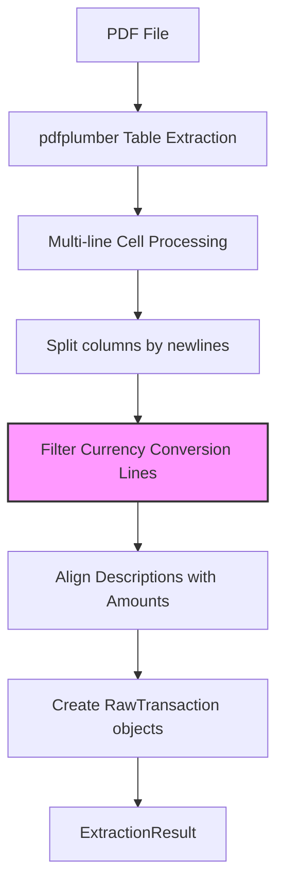

# Design Document: PDF Currency Line Fix

## Overview

This design addresses the misalignment issue in Desjardins Mastercard PDF statement imports caused by foreign currency conversion lines. The fix involves detecting and filtering out currency conversion lines from the description column before aligning descriptions with amounts.

The root cause is that foreign currency transactions include an extra line in the description column (e.g., "2,18 EURO TX: 1.527522") that has no corresponding entry in the amount column. This causes a 1-line offset that propagates through all subsequent transactions.

## Architecture

The fix is localized to the `PDFExtractor` class in `backend/app/services/pdf_extractor.py`. No changes to the overall architecture are required.



The new step (highlighted) filters currency conversion lines from the description column before alignment occurs.

## Components and Interfaces

### Modified Component: PDFExtractor

#### New Private Method: `_is_currency_conversion_line`

```python
def _is_currency_conversion_line(self, line: str) -> bool:
    """
    Check if a line is a currency conversion info line.
    
    Currency conversion lines appear in foreign currency transactions and follow
    the pattern: "<amount> <currency> TX: <exchange_rate>"
    Examples:
        - "2,18 EURO TX: 1.527522"
        - "15,00 USD TX: 1.345678"
    
    Args:
        line: A single line from the description column
        
    Returns:
        True if the line is a currency conversion line, False otherwise
    """
```

#### New Private Method: `_filter_currency_conversion_lines`

```python
def _filter_currency_conversion_lines(self, description_lines: list[str]) -> list[str]:
    """
    Filter out currency conversion lines from description lines.
    
    Args:
        description_lines: List of description lines from a multi-line cell
        
    Returns:
        Filtered list with currency conversion lines removed
    """
```

#### Modified Method: `_extract_transactions_from_table`

The existing method will be modified to call `_filter_currency_conversion_lines` on the description column before aligning with amounts.

### Interface Contract

The public interface of `PDFExtractor` remains unchanged:
- `validate_file(file_path: Path) -> tuple[bool, str | None]`
- `extract(file_path: Path) -> ExtractionResult`

## Data Models

No changes to data models. The existing `RawTransaction` and `ExtractionResult` dataclasses remain unchanged.

```python
@dataclass
class RawTransaction:
    date_str: str
    description: str
    amount_str: str

@dataclass
class ExtractionResult:
    statement_date: date | None = None
    statement_total_cents: int | None = None
    transactions: list[RawTransaction] = field(default_factory=list)
    errors: list[str] = field(default_factory=list)
    success: bool = False
```


## Correctness Properties

*A property is a characteristic or behavior that should hold true across all valid executions of a system—essentially, a formal statement about what the system should do. Properties serve as the bridge between human-readable specifications and machine-verifiable correctness guarantees.*

### Property 1: Currency Conversion Line Detection Accuracy

*For any* string that matches the pattern `^\s*\d+[,\.]\d{2}\s+[A-Z]{2,4}\s+TX:\s*\d+[,\.]\d+\s*$`, the `_is_currency_conversion_line` method SHALL return True. *For any* string that does not match this exact pattern (including strings where the pattern appears as a substring of a longer line), the method SHALL return False.

**Validates: Requirements 1.1, 1.2, 1.3**

### Property 2: Currency Line Filtering Preserves Non-Currency Lines

*For any* list of description lines, after filtering with `_filter_currency_conversion_lines`:
- All lines that are NOT currency conversion lines SHALL be present in the output in the same order
- All lines that ARE currency conversion lines SHALL be absent from the output
- The output length SHALL equal the input length minus the count of currency conversion lines

**Validates: Requirements 2.1, 2.2**

### Property 3: Alignment Correctness After Filtering

*For any* multi-line cell extraction where descriptions and amounts are split by newlines, after filtering currency conversion lines from descriptions:
- The count of filtered descriptions SHALL equal the count of amounts
- Each description SHALL be paired with its corresponding amount at the same index
- No extracted transaction description SHALL contain the pattern `[A-Z]{2,4}\s+TX:`

**Validates: Requirements 3.1, 3.4, 4.1**

### Property 4: Backward Compatibility for Domestic Transactions

*For any* list of description lines that contains zero currency conversion lines, the `_filter_currency_conversion_lines` method SHALL return the input list unchanged (same elements, same order, same length).

**Validates: Requirements 5.1, 5.2**

## Error Handling

### Edge Cases

1. **Empty description lines**: If a description line is empty or whitespace-only, it should NOT be treated as a currency conversion line.

2. **Partial matches**: Lines like "PAYMENT 2,18 EURO TX: 1.527522 CONFIRMED" should NOT be filtered (pattern must match entire line).

3. **Multiple currency lines**: If a transaction has multiple currency conversion lines (unlikely but possible), all should be filtered.

4. **No currency lines**: Statements without any foreign currency transactions should process identically to before.

### Error Conditions

The fix does not introduce new error conditions. Existing error handling in `PDFExtractor` remains unchanged:
- Invalid PDF files → validation error
- No transactions found → error in result
- Malformed table data → graceful degradation to text extraction

## Testing Strategy

### Dual Testing Approach

This fix requires both unit tests and property-based tests:

1. **Property-based tests** (using Hypothesis): Verify universal properties across generated inputs
2. **Unit tests**: Verify specific examples using the fixture PDF

### Property-Based Testing Configuration

- **Library**: Hypothesis (already used in the project)
- **Minimum iterations**: 100 per property test
- **Tag format**: `Feature: pdf-currency-line-fix, Property N: <property_text>`

### Test Categories

#### Property Tests (Hypothesis)

1. **Currency line detection property test**
   - Generate valid currency conversion lines → assert detected
   - Generate invalid lines → assert not detected
   - Generate lines with pattern as substring → assert not detected

2. **Filtering preservation property test**
   - Generate mixed lists of currency and non-currency lines
   - Assert non-currency lines preserved in order
   - Assert currency lines removed

3. **Backward compatibility property test**
   - Generate lists with no currency lines
   - Assert output equals input

#### Unit Tests (Fixture-based)

1. **Specific transaction assertions**
   - MUSIC-A STOCKHOLM AB has amount 20.57
   - Serv-A Paris FR has amount 3.33
   - RESTAURANT AAA___ VILLE-D QC has amount 41.40

2. **Count assertions**
   - Total expense transactions = 83

3. **No currency text in descriptions**
   - No transaction description contains "EURO TX:" or "USD TX:"

### Test File Location

Tests will be added to `backend/tests/services/test_pdf_extractor.py` following the existing test patterns.
