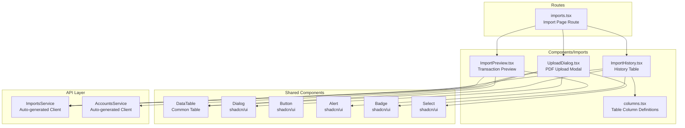
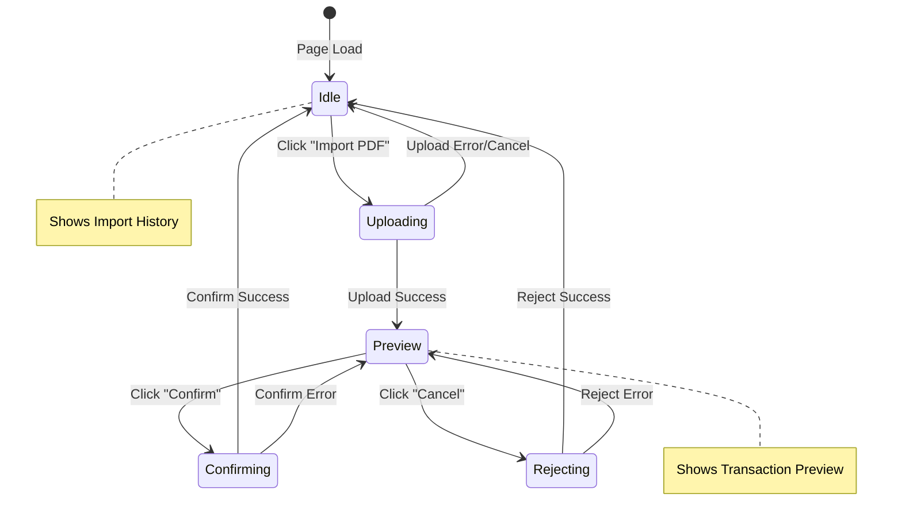

# Design Document: PDF Import UI

## Overview

This design document describes the frontend implementation for the PDF Import UI feature. The feature enables users to import transactions from Mastercard PDF statements through a multi-step workflow: upload, preview, and confirm/reject. The implementation follows existing frontend patterns using React 19, TypeScript, TanStack Router, TanStack Query, shadcn/ui components, and React Hook Form with Zod validation.

The backend API is already fully implemented with endpoints for upload, confirm, reject, list, and get import details. The frontend will integrate with these endpoints through the auto-generated API client.

## Architecture

### Component Architecture



### State Management



### Data Flow

1. **Upload Flow**: User selects PDF + account → API extracts transactions → Preview displayed
2. **Confirm Flow**: User confirms → API persists transactions → History refreshed
3. **Reject Flow**: User cancels → API discards data → History refreshed
4. **History Flow**: Page loads → API fetches import sessions → Table displayed

## Components and Interfaces

### Route Component

**File**: `frontend/src/routes/_layout/imports.tsx`

```typescript
// Route definition following TanStack Router file-based routing
export const Route = createFileRoute("/_layout/imports")({
  component: Imports,
  head: () => ({
    meta: [{ title: "Import Statements - Personal Finance Tracker" }],
  }),
})

function Imports() {
  // State for managing preview visibility
  const [previewData, setPreviewData] = useState<ImportPreviewPublic | null>(null)
  
  // Render upload button, preview (if active), and history table
}
```

### UploadDialog Component

**File**: `frontend/src/components/Imports/UploadDialog.tsx`

```typescript
interface UploadDialogProps {
  onUploadSuccess: (preview: ImportPreviewPublic) => void
}

// Form schema using Zod
const uploadSchema = z.object({
  file: z.instanceof(File).refine(
    (file) => file.type === "application/pdf",
    "Please select a PDF file"
  ),
  accountId: z.string().uuid("Please select an account"),
})

type UploadFormData = z.infer<typeof uploadSchema>
```

### ImportPreview Component

**File**: `frontend/src/components/Imports/ImportPreview.tsx`

```typescript
interface ImportPreviewProps {
  preview: ImportPreviewPublic
  onConfirm: () => void
  onReject: () => void
  isConfirming: boolean
  isRejecting: boolean
}

// Displays transaction table, totals, warnings, and action buttons
```

### ImportHistory Component

**File**: `frontend/src/components/Imports/ImportHistory.tsx`

```typescript
// Uses useSuspenseQuery to fetch import history
// Renders DataTable with import session columns
// Shows empty state when no imports exist
```

### Column Definitions

**File**: `frontend/src/components/Imports/columns.tsx`

```typescript
// Preview columns for transaction preview table
export const previewColumns: ColumnDef<TransactionPreview>[] = [
  { accessorKey: "date_transaction", header: "Date" },
  { accessorKey: "description", header: "Description" },
  { accessorKey: "amount_cents", header: "Amount", cell: formatCurrency },
  { accessorKey: "type", header: "Type", cell: formatType },
]

// History columns for import session table
export const historyColumns: ColumnDef<ImportSessionPublic>[] = [
  { accessorKey: "file_name", header: "File Name" },
  { accessorKey: "account_id", header: "Account" },
  { accessorKey: "status", header: "Status", cell: renderStatusBadge },
  { accessorKey: "transaction_count", header: "Transactions" },
  { accessorKey: "created_at", header: "Date", cell: formatDate },
]
```

### Sidebar Navigation Update

**File**: `frontend/src/components/Sidebar/AppSidebar.tsx`

```typescript
// Add Import item to baseItems array
const baseItems: Item[] = [
  { icon: Home, title: "Dashboard", path: "/" },
  { icon: Wallet, title: "Accounts", path: "/accounts" },
  { icon: Receipt, title: "Transactions", path: "/transactions" },
  { icon: Upload, title: "Import", path: "/imports" },  // New item
  { icon: Tag, title: "Categories", path: "/categories" },
  { icon: BarChart3, title: "Analysis", path: "/analysis" },
]
```

## Data Models

### API Types (from auto-generated client)

```typescript
// Import preview response from upload
type ImportPreviewPublic = {
  import_id: string
  file_name: string
  statement_date: string | null
  statement_total_cents: number | null
  calculated_total_cents: number
  totals_match: boolean
  transactions: TransactionPreview[]
  warnings: string[]
}

// Single transaction in preview
type TransactionPreview = {
  date_transaction: string
  description: string
  amount_cents: number
  type: TransactionType  // "expense" | "income" | "transfer"
}

// Import result after confirmation
type ImportResultPublic = {
  import_session_id: string
  transactions_imported: number
  success: boolean
}

// Import session for history
type ImportSessionPublic = {
  id: string
  file_name: string
  account_id: string
  status: ImportStatus  // "pending" | "completed" | "rejected" | "failed"
  transaction_count: number
  statement_date: string | null
  statement_total_cents: number | null
  calculated_total_cents: number | null
  error_message: string | null
  created_at: string
  completed_at: string | null
}
```

### Component State Types

```typescript
// Upload form state
interface UploadFormState {
  file: File | null
  accountId: string | null
}

// Page-level state
interface ImportPageState {
  previewData: ImportPreviewPublic | null
  isUploadDialogOpen: boolean
}
```

### Query Keys

```typescript
// TanStack Query key conventions
const queryKeys = {
  imports: ["imports"] as const,
  importDetail: (id: string) => ["imports", id] as const,
  accounts: ["accounts"] as const,
}
```

## Correctness Properties

*A property is a characteristic or behavior that should hold true across all valid executions of a system—essentially, a formal statement about what the system should do. Properties serve as the bridge between human-readable specifications and machine-verifiable correctness guarantees.*

### Property 1: File Type Validation Rejects Non-PDF Files

*For any* file that is not a PDF (e.g., .txt, .jpg, .docx, .xlsx), when selected in the upload dialog, the form validation SHALL reject it and display the error message "Please select a PDF file".

**Validates: Requirements 2.4**

### Property 2: Preview Displays All Required Metadata

*For any* valid ImportPreviewPublic response, the Preview_View SHALL display the file_name, statement_date (if present), statement_total_cents, calculated_total_cents, and the count of transactions matching the transactions array length.

**Validates: Requirements 3.2, 3.4, 3.7**

### Property 3: Preview Table Contains Required Columns

*For any* ImportPreviewPublic with one or more transactions, the preview table SHALL render columns for Date, Description, Amount, and Type, with each transaction's data correctly displayed in the corresponding cells.

**Validates: Requirements 3.3**

### Property 4: Preview Displays All Warnings

*For any* ImportPreviewPublic where totals_match is false OR warnings array is non-empty, the Preview_View SHALL display an alert for the totals mismatch (if applicable) AND an alert for each warning in the warnings array.

**Validates: Requirements 3.5, 3.6**

### Property 5: History Table Contains Required Columns

*For any* list of ImportSessionPublic records, the History_Table SHALL render columns for File Name, Account, Status, Transactions, and Date, with each import session's data correctly displayed.

**Validates: Requirements 5.2**

### Property 6: Status Badges Use Correct Styling

*For any* ImportSessionPublic with a status value, the History_Table SHALL render a Badge component with the appropriate variant: "default" for pending, "success" for completed, "secondary" for rejected, and "destructive" for failed.

**Validates: Requirements 5.4**

### Property 7: API Errors Are Displayed to User

*For any* API error response from the import endpoints, the UI SHALL extract and display the error message to the user via a toast notification, using the existing error handling utilities.

**Validates: Requirements 6.2**

## Error Handling

### Error Categories

| Error Type | Source | User Message | UI Behavior |
|------------|--------|--------------|-------------|
| Invalid file type | Client validation | "Please select a PDF file" | Form validation error |
| Missing account | Client validation | "Please select an account" | Form validation error |
| Network error | Axios | "Unable to connect to the server..." | Toast + retry option |
| Invalid PDF | API 400 | "Invalid file type. Please upload a PDF file." | Toast, close dialog |
| Corrupted PDF | API 400 | "The PDF file appears to be corrupted..." | Toast, close dialog |
| Extraction failed | API 400 | API error message | Toast, close dialog |
| No transactions | API 400 | "No transactions found in the PDF" | Toast, close dialog |
| Preview expired | API 400 | "Import preview has expired..." | Toast, close preview |
| Confirm failed | API 500 | API error message | Toast, keep preview open |
| Reject failed | API 500 | API error message | Toast, keep preview open |

### Error Handling Implementation

```typescript
// Use existing error utilities from utils.ts
import { extractErrorMessage, getErrorCode, ERROR_CODES } from "@/utils"

// In mutation onError handlers
onError: (err) => {
  const errorCode = getErrorCode(err as Error)
  const errorMessage = extractErrorMessage(err as Error)
  
  if (errorCode === ERROR_CODES.NETWORK_ERROR) {
    showRetryToast(errorMessage, () => mutation.mutate(data))
  } else {
    showErrorToast(errorMessage)
  }
}
```

## Testing Strategy

### Unit Tests

Unit tests will focus on:
- Component rendering with various props
- Form validation logic
- Utility functions (currency formatting, date formatting)
- Status badge variant mapping

### Property-Based Tests

Property-based tests are not applicable for this frontend feature as the properties defined are UI rendering properties that are better tested through E2E tests with specific examples. The properties ensure:
- Correct data display for any valid API response
- Consistent error handling for any error type
- Proper validation for any file type

### E2E Tests (Playwright)

E2E tests will validate the complete user workflows:

**File**: `frontend/tests/imports.spec.ts`

```typescript
test.describe("PDF Import", () => {
  // Navigation tests
  test("Import page is accessible from sidebar")
  test("Import page displays header and description")
  
  // Upload dialog tests
  test("Upload dialog opens and has required fields")
  test("Upload dialog validates file type")
  test("Upload dialog validates account selection")
  
  // Preview tests (requires mock API or test PDF)
  test("Preview displays transaction table")
  test("Preview shows totals and warnings")
  test("Confirm button imports transactions")
  test("Cancel button rejects import")
  
  // History tests
  test("History table displays past imports")
  test("History shows correct status badges")
  test("Empty state shown when no imports")
})
```

### Test Configuration

- E2E tests use authenticated state from `playwright/.auth/user.json`
- Tests run against the full stack (backend + frontend)
- Mock API responses may be used for specific error scenarios

